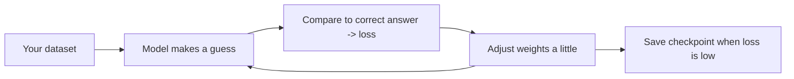

# Model Training Crash Course (for the Dagbani language pack)

Beginner-friendly notes. No prior ML experience assumed. Written specifically for
this project: fine-tuning an **English -> Dagbani translator** and packaging a
**Dagbani text-to-speech (TTS) voice** so they run offline in the mobile app.

---

## 1. The one big idea: you are NOT training from scratch

Training a language model from zero needs millions of dollars and billions of
sentences. You will never do that here. Instead you do **fine-tuning**:

> Take a model that already learned "how language works" from huge data, then
> nudge it with your small dataset so it learns your specific task.

Analogy: you're not teaching someone to read from birth. You're taking a fluent
adult and teaching them one new skill (Dagbani <-> English) over a weekend.

Two things you'll actually produce:
1. **Translator** - fine-tune an existing multilingual model on English/Dagbani
   sentence pairs.
2. **TTS voice** - mostly *reuse* an existing Dagbani voice; training your own is
   optional and much harder (needs clean audio recordings).

---

## 2. Vocabulary you need (and nothing more)

- **Model**: a big math function with millions of tunable numbers ("weights").
- **Weights / parameters**: the numbers the model learns. "600M" = 600 million of them.
- **Dataset**: your examples. For translation: pairs like
  `("Feed only breast milk", "Mɔɣisim bia maa bihili ko")`.
- **Training example**: one input + the correct answer.
- **Epoch**: one full pass through your whole dataset. You usually do 1-5.
- **Batch**: how many examples the model looks at before it updates itself.
- **Loss**: a number measuring how wrong the model is. Training tries to make it
  go **down**. Watching loss drop = learning is happening.
- **Learning rate**: how big a step the model takes when correcting itself. Too
  big = it never settles; too small = it learns painfully slowly. `2e-5` (that's
  0.00002) is a normal fine-tuning value.
- **Checkpoint**: a saved copy of the model partway through training.
- **Inference**: actually *using* the trained model to translate/speak.
- **Tokenizer**: splits text into small pieces ("tokens") of numbers the model
  understands, and converts numbers back to text. Every model ships with its own.
- **Fine-tuning**: continue-training an existing model on your data.
- **LoRA**: a cheap fine-tuning trick — instead of updating all 600M weights, you
  train a tiny "adapter" (a few million extra weights) and freeze the rest. Much
  faster, much less memory, and you can do it on a free/cheap GPU. This is what
  you'll use.
- **Quantization**: shrinking the finished model by storing weights in smaller
  numbers (e.g. `int8` instead of `float32`). ~4x smaller, a bit less accurate.
  Essential to fit on a phone.
- **ONNX**: a portable model file format that runs on phones (via ONNX Runtime /
  sherpa-onnx). You *export* your trained model to ONNX for the app.

---

## 3. The mental model of training (the loop)



That's it. The computer repeats "guess -> measure error -> nudge weights"
thousands of times. You mostly just prepare good data and watch the loss.

---

## 4. What you actually do, start to finish

### Step 0 - Environment
- Use **Google Colab** (free GPU, nothing to install locally) or a rented GPU.
  A first-timer should start in Colab.
- Language is **Python**. Main libraries:
  - `transformers` (models + tokenizers)
  - `datasets` (load/prepare data)
  - `peft` (LoRA fine-tuning)
  - `optimum` + `onnxruntime` (export to ONNX for the phone)

### Step 1 - Get and clean the data (this is 80% of the work)
Sources we already found on Hugging Face:
- `ghananlpcommunity/ghana-bible-combined-90k-twi-ewe-dagbani` (~90k Bible pairs)
- `narteybrown/sobolo-corpus-dagbani-bible` (Bible pairs)
- `mohammednuruddin/dagbani`, `Wuninsu/english_to_dagbani`,
  `abdulhafis/Dagbani_English_Dataset` (smaller EN/Dagbani sets)
- Your app's own health tips in `packages/content/nutrition.json` (small but the
  domain that matters most).

Cleaning checklist (skipping this is the #1 beginner mistake):
- Remove duplicates.
- Make sure each English row truly matches its Dagbani row (alignment).
- **Split** into train / validation / test — and make sure the *same Bible verse
  never appears in both train and test*, or your scores will be fake.
- Note each row's license and domain (Bible vs health).

> Note: most Bible/GhanaNLP data is **CC-BY-NC (non-commercial)**. Fine for a
> hackathon/research; check before any commercial release.

### Step 2 - Pick a base model
For a phone-sized translator, start small:
- `t5-small` (tiny, easiest to fit on a phone) — realistic first attempt.
- If quality is too low, step up to `facebook/nllb-200-distilled-600M`, but note
  it's ~1 GB after export and Dagbani isn't officially in it, so results vary.

### Step 3 - Fine-tune with LoRA
Conceptually just a few lines:
```python
from transformers import AutoModelForSeq2SeqLM, AutoTokenizer, Trainer, TrainingArguments
from peft import LoraConfig, get_peft_model

model = AutoModelForSeq2SeqLM.from_pretrained("t5-small")
tok = AutoTokenizer.from_pretrained("t5-small")
model = get_peft_model(model, LoraConfig(r=8, lora_alpha=16, task_type="SEQ_2_SEQ_LM"))

# ... tokenize your dataset ...
Trainer(model=model, args=TrainingArguments(
    learning_rate=2e-5, num_train_epochs=3, per_device_train_batch_size=16,
), train_dataset=train, eval_dataset=val).train()
```
While it runs, watch that **loss goes down** and validation loss doesn't shoot
back up (that would be **overfitting** = memorizing instead of learning).

### Step 4 - Evaluate (don't trust vibes)
- **BLEU** and **chrF**: automatic scores (0-100, higher = better) comparing the
  model's output to the correct translation on your held-out test set.
- Reality check for Dagbani: even good LLMs score ~18 BLEU here, and one existing
  adapter scored **0.1** on English->Dagbani. So:
- **Always have a native speaker read a sample.** For health content, a wrong
  negation or dosage is dangerous. Automatic scores are not enough.

### Step 5 - Export + shrink for the phone
- Export encoder/decoder to **ONNX** with `optimum`.
- **Quantize to int8** to shrink ~4x.
- This is the file the app actually loads.

### Step 6 - Ship behind a safety gate
If quality/memory aren't good enough, the app falls back to **reviewed, fixed
translations** of the health tips (pre-translated and checked by a human) instead
of live model output. Better to speak fewer sentences correctly than many wrongly.

---

## 5. The TTS half (usually no training needed)

Text-to-speech is different from translation. Good news: Dagbani voices already
exist as small **VITS** models, and one is already exported for phones:
- `FarmerlineML/dagbani_tts-2025_v2` (VITS, ~36M params — small!)
- `michsethowusu/stabletts-ghana-twi-ewe-dagbani` (has a **sherpa-onnx** export:
  `model.onnx`, `tokens.txt`, `lexicon.txt`, `vocos.onnx`) — drop-in offline.

So for TTS your job is mostly:
1. Test the existing voices on Dagbani health sentences.
2. Pick the smallest one that sounds clear.
3. Package its files + a checksum manifest for the app to download.

Training your *own* voice is only needed if none sound good, and it requires
several hours of clean single-speaker Dagbani recordings with transcripts — treat
that as a later, optional project.

---

## 6. Common beginner traps

- **Data leakage**: same sentence in train and test -> fake-high scores. Split carefully.
- **Overfitting**: too many epochs on tiny data -> memorizes, fails on new text.
  Watch validation loss; stop when it stops improving.
- **Trusting BLEU alone**: for a health app, human review is mandatory.
- **Wrong tokenizer**: always use the tokenizer that matches your base model.
- **Forgetting licenses**: non-commercial data can't ship in a paid product.
- **Bundling a 1 GB model in the app**: download it separately, verify checksum.

---

## 7. Suggested first weekend

1. Open a Colab notebook.
2. Load `ghananlpcommunity/ghana-bible-combined-90k-twi-ewe-dagbani`, filter to
   English/Dagbani, clean + split.
3. LoRA fine-tune `t5-small` for English->Dagbani, 3 epochs.
4. Print BLEU/chrF and eyeball 20 translations.
5. Export to ONNX + int8.
6. Separately, run the existing `dagbani_tts` voice on 5 sentences and listen.

If step 4 looks promising, wire it into the app per the plan. If not, fall back to
human-reviewed fixed translations — and that's a perfectly good outcome.

---

## 8. Glossary quick-reference

| Term | Plain meaning |
|------|---------------|
| Fine-tune | Continue-train an existing model on your data |
| LoRA | Cheap fine-tuning; train a small adapter, freeze the rest |
| Epoch | One pass over all your data |
| Loss | How wrong the model is (want it lower) |
| Learning rate | Step size when correcting; ~2e-5 for fine-tuning |
| Overfitting | Memorizing training data, failing on new data |
| Tokenizer | Turns text into numbers and back |
| BLEU / chrF | Automatic translation quality scores |
| Quantization | Shrink model (int8) to fit a phone |
| ONNX | Portable model format the phone app runs |
| Inference | Using the trained model for real |
| VITS | Small neural TTS architecture (the Dagbani voices use it) |
